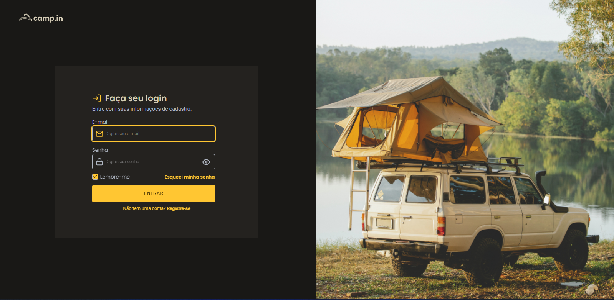

# Login Form CSS

* Este é um desafio da Trilha Fundamentar do Discover da Rocketseat.
* Foram usadas as linguagens HTML e CSS.
* O layout foi baseado em um projeto no Figma: https://www.figma.com/file/SX8XFyC5fAY09ai8Oykz0T/DD-%2F-Login-Form---CSS/duplicate

* Este é o resultado final:

